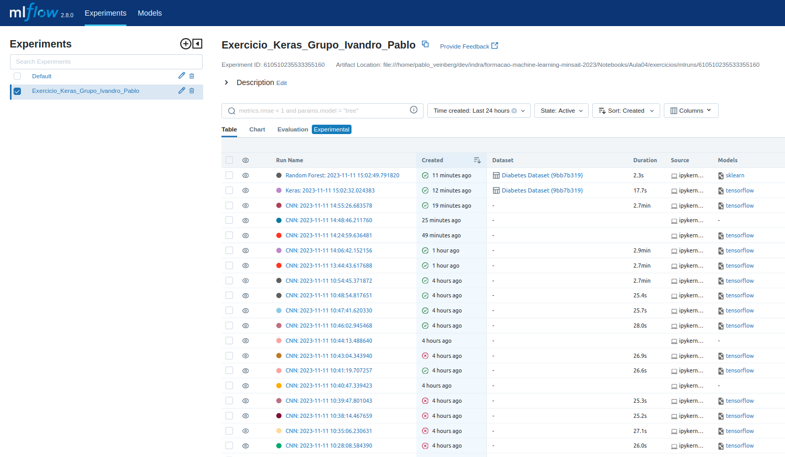
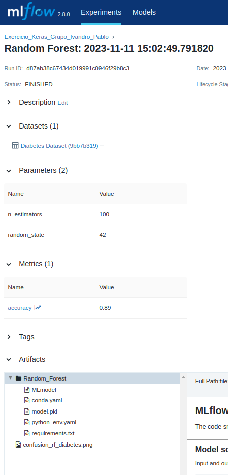
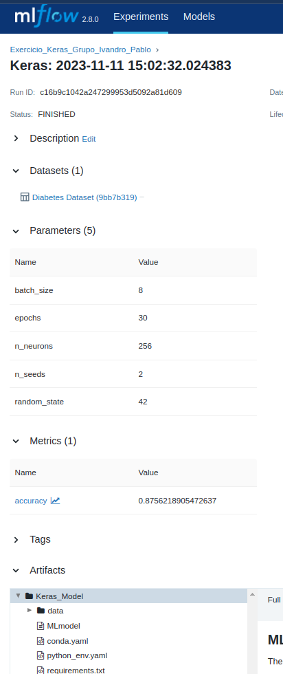
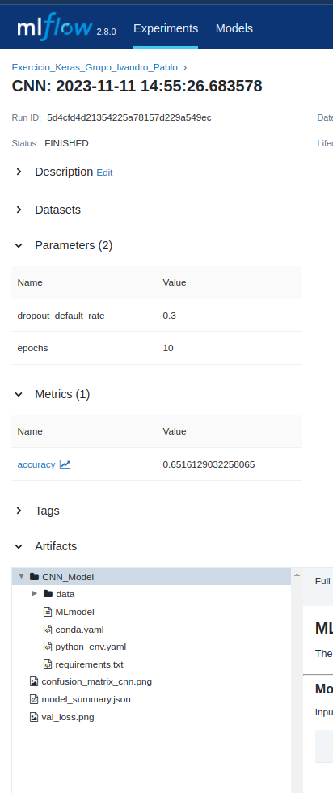
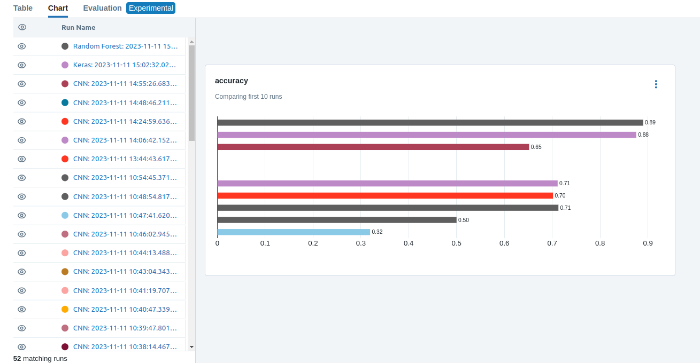

PRÁTICA MLFLOW
==============

1. Treine um classificador de ensemble e uma rede do keras para o dataset de diabetes.
[Script](https://github.com/pveinberg/formacao_ML_minsait/blob/develop/Notebooks/Aula04/exercicios/01_mlflow_ensamble_keras_diabetes.ipynb)

1. Treine um classificador com CNN para o dataset de imagens do cérebro
[Script](https://github.com/pveinberg/formacao_ML_minsait/blob/develop/Notebooks/Aula04/exercicios/02_mlflow_classificaocao_cnn_local_dropout.ipynb)

1. Nomeie seu experimento Grupo seguido de underscore, seguido dos primeiros nomes de cada participante do grupo separados por underscore exemplo: "Grupo_Diego_Thais" 
`Exercicio_Keras_Grupo_Ivandro_Pablo`

1. Use MLFLow para salvar as ***estatísticas*** e ***hiperparametros*** de cada modelo.

1. Faça deploy ***localmente*** de cada modelo

**Random Forest**
`mlflow models serve -m runs:/bd93f474eeae429fb5c242fcb4c18ca4/"Random_Forest --port=5001 --env-manager local`

**Keras**
`mlflow models serve -m runs:/81e519aaa7684252ad1be41752efa72b/Keras_Model --port=5002 --env-manager local`

**CNN**
`mlflow models serve -m runs:/a470d0a8d2f5430493efabc2a4f4c5fa/CNN_Model --port=5003 --env-manager local`

6. Faça uma requisição pro deploy de cadas modelo
**[Requisições e retornos no final de cada script.]**